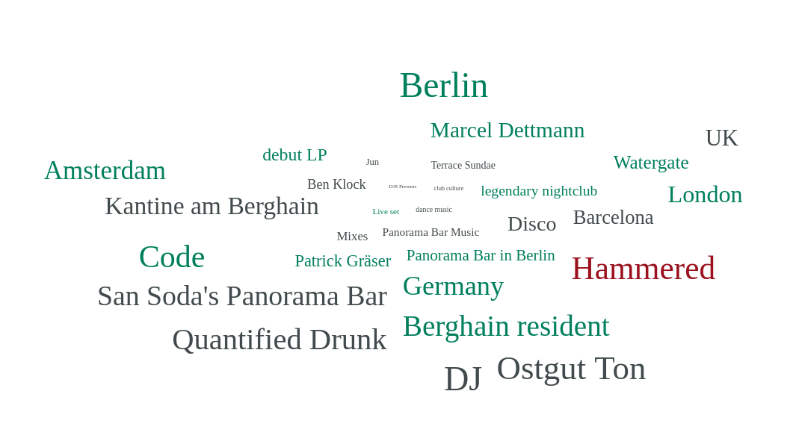
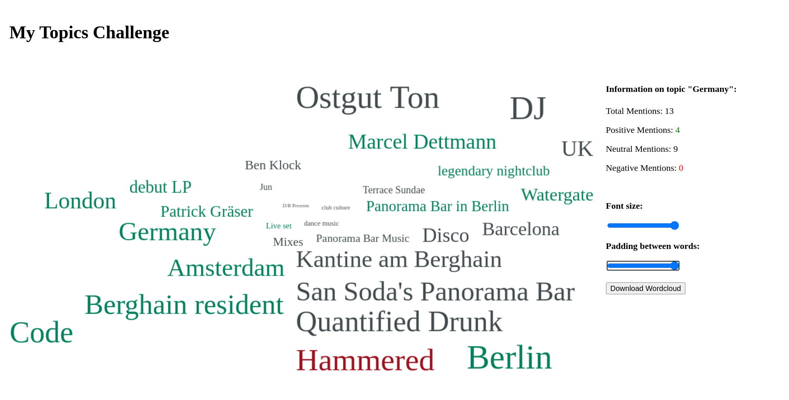

# My Javascript Wordcloud



This project is the implementation of a coding challenge by Brandwatch.
You can find it [on their git gist here](https://gist.github.com/grahamscott/65b43572ad18c5fbdd87)!
My implementation takes a json file provided in the gist repo, and produces an **interactive website** where you can see a wordcloud display of the words inside that json file.
You can play around with the size of the font used and the distance between the words in the cloud, and, at the end, you can also download the image for later!
If you click _(or tap)_ on any of the words in the cloud, you get more information about it on the side of the screen!

# How to run it 🏃

I prepared two ways to run the project:

### Using Docker 🐋

```console
$ docker run -it -p 3000:3000 tymscar/javascript-wordcloud
```

This will handle everything for you. It will download all the dependencies and spin up an interactive docker container with the project running inside. All you have to do then is to visit [localhost:3000/](http://localhost:3000/) in any browser and you should be good to go.

### Running the express server natively locally on your computer 💻

First, you need to clone the project to your local storage

```console
$ git clone https://github.com/tymscar/javascript-wordcloud
```

Then you want to go to the newly cloned directory

```console
$ cd javascript-wordcloud
```

You now want to download all the dependencies

```console
$ npm install
```

And finally, run the project

```console
$ npm start
```

Now all that there is left to do is visit [localhost:3000/](http://localhost:3000/) in any browser and you should be good to go.

**P.S.** If you want to run this project you can do so without `node` and `express` as well. All you have to do is host the files in the `public` folder using any webserver such as [Apache](https://httpd.apache.org/docs/), [NGINX](https://nginx.org/en/docs/) or others.

# Usage 🖱️



Working on this project I tried to keep it as true to the diagram in the _requirements_ as possible.
When you first open up the page you are greeted with the wordcloud on the _left_ and a menu on the _right_.
You have 2 sliders on the right which let you change the size of the font dynamically as well as a button that lets you download the wordcloud you have just configured.
When you click or tap on any of the words in the cloud, you get more information about that specific word in the side menu!

# Tools and Technologies 🧰

The project requirements provided me with the freedom to pick any libraries and tools I want for the project.
After careful assessment of the criteria, I figured that the overhead that a canvas library would bring was not worth it for this particular project. I also never used vanilla HTML [Canvas](https://developer.mozilla.org/en-US/docs/Web/API/Canvas_API) before so I thought it would also be an interesting challenge to figure out!
Another benefit this approach brought was better browser compatibility.
One of the _downsides_ was the difficulty of unit testing the part of the code that wrote to the canvas.
If given more time I would write a testing tool that could create canvas images of the expected result and then compare them to the actual result.
This would be easier to unit test but would also raise interesting challenges of its own, such as when do you know that two pictures are identical? There could be slight differences in the images because of compression.
The testing was carried out using [Jest](https://jestjs.io/)
[Node](https://nodejs.org/en/) and [Express](https://expressjs.com/) were used to host the website and [Docker](https://www.docker.com/) for easy deployment of it!

# What would I improve? 📈

If I were to continue working on the project I would want to improve the following:

- Create a way to unit test the Canvas drawing
- Improve the responsiveness of the website
- Use Babel to get full support on all the required browsers _(Read more about this in the next section)_

# Browser compatibility 🔖

```
Chrome  (62+)         - 42%     ✔️
Safari  (11+)         - 23%     ✔️
MS Edge (40+)         - 14.5%   ✔️
Firefox (57+)         - 20%     ⚠️
Other                 - 0.5%
```

Firefox Versions 57 to 59 have to enable support for ES6 modules in `about:config`. They are less than `0.03%` of all global users. Firefox version 59 and newer can run it without an issue!
